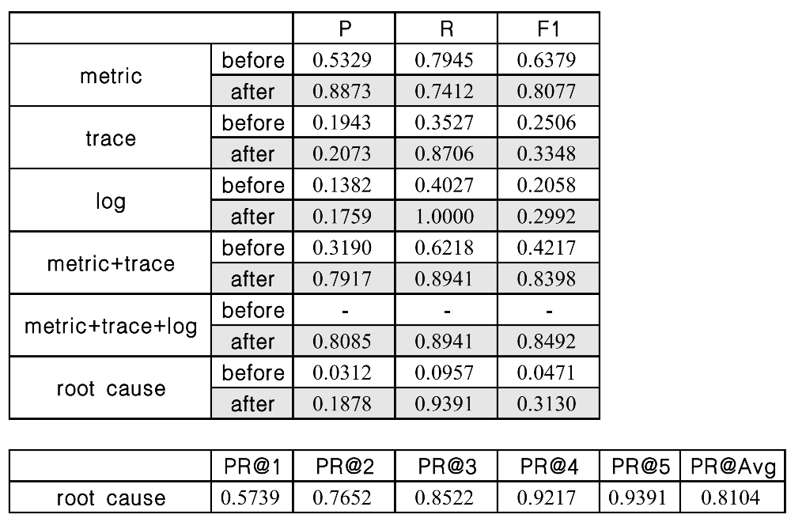

# Experimental setup

- Train:
  - Train data (update model): **2022-03-24 15:20:00** ~ **2022-03-25 08:06:00**
  - Valid data (prevent overfitting): **2022-03-25 08:07:00** ~ **2022-03-25 15:19:00**
- Test:
  - Valid data (search threshold): **2022-03-26 08:30:00** ~ **2022-03-26 11:29:00**
  - Test data (evaluation model): **2022-03-26 11:30:00** ~ **2022-03-26 20:29:00**

# result

# more

- See [Log](./log.md) for training and testing logs.
- See [Loss](./result/img/) for loss visualization.